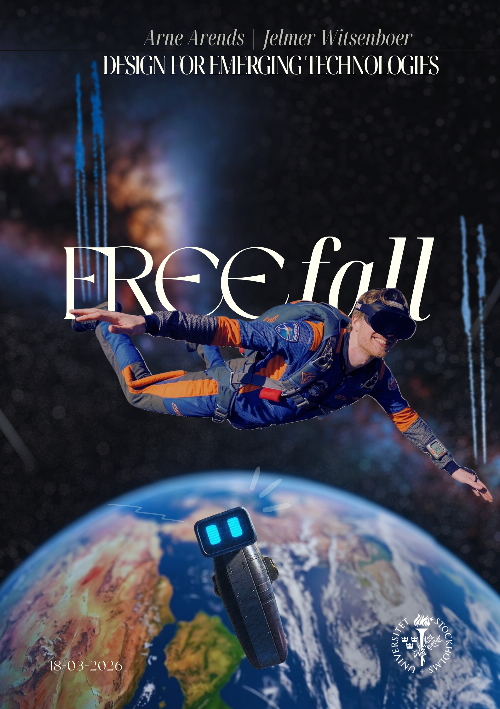

# Freefall

 

 
## Introduction

**Freefall** is an experience where you feel what it’s actually like to fall through Earth’s atmosphere. Wind and environmental effects create a fully immersive sensation of descent. Amidst the chaos of the fall, the user has a clear goal: using only their hands, they must reassemble their broken robot companion so it can safely join them on the rest of the journey.

**The Problem & Design Question:** The core design challenge was exploring how to realistically recreate the physical and psychological sensation of flying and falling using Virtual Reality, specifically by augmenting the visual experience with physical, tangible elements. 

**The Proposed Solution:**
Our solution bridges the gap between the digital and physical world to trick the user's senses into feeling true freefall. By combining physical suspension (lying sideways in a hammock) with real-time sensory feedback (wind) and custom hardware (body-mounted accelerometer), the user experiences a level of immersion that standard VR controllers are not able to provide. 

## System Description & Features

Freefall combines software and custom tangible interfaces to create a full-body experience. Key features and implementations include:

* **Tangible Suspension Setup:** The user lies sideways in a hammock, removing the sensation of standing on solid ground and simulating the physical posture of a skydiver.
* **Physical Wind Integration:** A physical fan is used to blow air directly into the user's face to imitate the wind during descent.
* **Dynamic Wind Audio:** By utilizing the VR headset's gyroscope, the angle of the user's head dynamically adjusts the wind audio and effects relative to their ears, enhancing spatial realism.
* **Controller-Free Interaction:** The experience relies entirely on VR hand-tracking, allowing the user to naturally grab and assemble the broken robot pieces mid-air.
* **Custom Tangible Input (ESP32):** We developed a custom hardware solution using an ESP32 micro-controller attached to the user's back. This unit:
    * Utilizes a 3-axis accelerometer/gyroscope.
    * Streams data over a Wi-Fi socket to Unity.
    * Translates real-time body orientation into 1D movement along the X-axis for body-steering.
* **Hardware Calibration:** A physical **recalibrate button** is integrated into the setup. This allows the facilitator to instantly reset the virtual world's orientation to match the user's physical position in the hammock.
* **Facilitator Control (Wizard of Oz Backend):** We implemented a back-end solution featuring command-line scripts. This allows a facilitator to execute core commands, such as remotely executing a recalibration or triggering the parachute event.
* **Wizard of Oz Parachute:** The climax of the experience, pulling the parachute, is facilitated using a "Wizard of Oz" technique to ensure a seamless and tactile transition out of the freefall. This is also used as a safety trigger in case of nausea or when getting too close to the ground.
* **Passthrough Grounding:** To ensure a safe offboarding, the experience ends by returning to the starting screen in AR passthrough mode, helping ground the user before they take off the headset.

**Watch the demo video of our physical setup here:**
[Link to Demo Video](https://your-link-here.com)

## Design Process

Our design journey focused heavily on rapid prototyping.

* **Brainstorming & Concept:** We began with a small brainstorming session (captured in early sketches). Our goal was to map the physical constraints of a fall to the available technologies. We defined the core loop using the **MoSCoW method** (Must have, Should have, Could have, Won't have), which allowed us to prioritize the critical "falling sensation" elements first.
* **User Journey (Physical-to-Virtual):** We mapped the user's journey from being harnessed into the hammock to the final parachute pull. Crucial touchpoints included managing the transition from standing to horizontal, and ensuring the self-calibration function was intuitive.

### Process Gallery

 
*Early sketch of the initial idea.*

 

 
*Image of our Trello board, where the project was broken down into manageable issues.*

 

 
*The MoSCoW method applied to prioritize features.*

## Installation

This project is built for the Meta Quest Pro / Quest 3 platform. As the XR Interaction Toolkit was used, it should be adaptable to other headsets as well.

### Hardware Requirements

| Component | Specification |
| -------- | ------ |
| **VR Headset** | Meta Quest Pro |
| **Micro-controller** | ESP32 |
| **Sensor** | Accelerometer (e.g., MPU6050) |
| **Physical Interface** | Fan, Large Hammock, Recalibrate Button (tactile) |

### Installation Steps (Software)

| Action | Platform | Requirements | Commands / Location |
| -------- | ------ | ------------ | -------- |
| 1. Clone Repo | Windows/macOS | Git, Python 3.11 | `git clone https://github.com/user/freefall.git` `cd freefall` |
| 2. Arduino & Python | PC & ESP32 | Wi-Fi sockets / Backend | Scripts found in `Assets/Arduino Communication/` |
| 3. Open Unity | PC | **Unity 6.3 LTS (5f1)**, XR Interaction Toolkit | Open project in Unity Hub. Switch target to Android (for VR build). |
| 4. Build and Run | PC / Quest Pro | Link Cable / AirLink | `File -> Build and Run` |

## Contributors

* **Arne Arends**
* **Jelmer Witsenboer**

---
*Created at Stockholm University - Design for Emerging Technologies (DET) - 2026*
